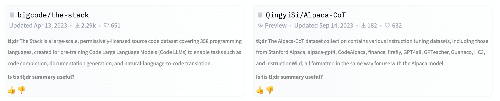
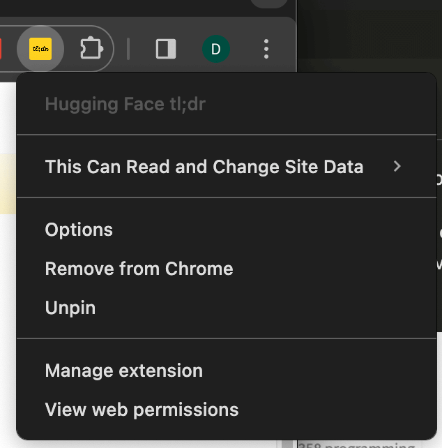
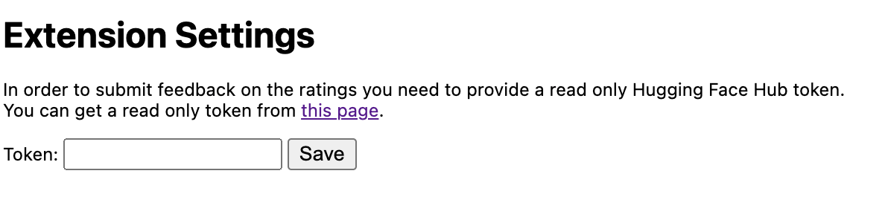

# Hugging Face tl;dr

  

  <i>An experimental Chrome extension that provides tl;dr summaries for datasets on the Hugging Face Hub!</i>

The Hugging Face tl;dr Chrome extension enhances your browsing experience on the Hugging Face Hub by providing concise tl;dr summaries for datasets. With this extension, you can quickly grasp the key points of a dataset when navigating through the Hugging Face Hub, making it easier to identify relevant datasets for your machine learning projects.

  

## ✨ Features

- 🤖 Automatically fetches and displays tl;dr summaries for datasets on the Hugging Face Hub
- 📜 Summaries are added as a compact section below each dataset card, making them easily noticeable
- 👍 Provide feedback on the usefulness of the summaries through a simple rating system

## 🚀 Getting Started

  
<b>Installation</b>

  1. Clone this repository or download the source code as a ZIP file using this [link](https://github.com/davanstrien/huggingface-tldr/archive/refs/heads/main.zip).
  2. If you downloaded the source code as a ZIP file, extract the contents to a directory on your computer.
  3. Open Google Chrome and navigate to `chrome://extensions`.
  4. Enable "Developer mode" using the toggle switch in the top right corner.
  5. Click on "Load unpacked" and select the `plugin` directory from the source code you downloaded.
  6. The Hugging Face tl;dr extension should now be installed and active in your Chrome browser.

<b>Usage</b>

  1. Navigate to the Hugging Face Hub and browse through the datasets.
  2. The extension will automatically fetch and display the tl;dr summaries below each dataset card.
  3. If you find a summary helpful, give it an upvote. If not, you can downvote it to provide feedback.
  4. To enable voting functionality and contribute to the improvement of the summaries, you need to provide a valid token in the extension settings. You can obtain a token from your Hugging Face account settings.

## 🔧 Extension Settings

To enable voting functionality and provide feedback on the tl;dr summaries, you need to provide a valid Hugging Face token in the extension settings. Follow the steps below to configure the extension settings:

1. Right-click on the extension icon in the Chrome toolbar.
2. Select "Options" from the context menu.
3. In the settings page, enter your Hugging Face token in the provided input field.
4. Click on the "Save" button to store the token.

Add a read-only token from your Hugging Face account settings to enable voting functionality.

Note: The token is securely stored in the extension's local storage and is only used for authenticating requests to the Hugging Face API when submitting votes. You only need to provide a read-only token, as the extension does not require write access to your Hugging Face account.

## Disclaimer

This extension is an experimental project. The tl;dr summaries are currently generated using [mistralai/Mixtral-8x7B-Instruct-v0.1](https://huggingface.co/mistralai/Mixtral-8x7B-Instruct-v0.1)

## Contributing

Contributions to the Hugging Face tl;dr extension are welcome! If you encounter any issues or have suggestions for improvements, please open an issue before submitting a pull request.
